# CSV Parsing & Variable Creation
> Variable Creation, Environment Validation & Constraint Matrix Processing — VSDSYNTH

<h2>🔍 Overview</h2>

- Built a **TCL-based CSV parsing engine** to dynamically convert configuration data into runtime variables — eliminating manual script edits between designs.
- Implemented **automated environment validation**, intelligent directory management, and a constraint matrix processing pipeline — validated end-to-end on the `openMSP430` design.

<h2>⚙️ Tasks Covered</h2>

| Task | Description |
|:---|:---|
| Variable Creation | CSV-to-TCL variable engine, absolute path mapping, runtime debug dashboard |
| Environment Validation | Library & directory checks, auto-creation of missing paths, constraint matrix loading |
| Matrix Row Computation | Programmatic dimensioning, array-matrix linking, boundary & header management |

<h2>📝 Stage Details</h2>

**Task 1 — Variable Creation & CSV Data Processing** &nbsp;|&nbsp; `struct::matrix` `csv` `TCL Arrays`

Developed a TCL-based CSV parsing engine using `struct::matrix` and `csv` packages to parse multi-column design data into a searchable internal matrix. Built an automated loop to read CSV keywords and assign them as global TCL variables for dynamic tool configuration. Implemented absolute path mapping using `file normalize` to prevent file access errors. Built a runtime debug dashboard to display all initialized design variables for immediate verification.

**Task 2 — Environment Validation & Constraint Matrix Conversion** &nbsp;|&nbsp; `File Checks` `Directory Management` `Exception Handling`

Implemented automated integrity validation to ensure all standard cell libraries and RTL directories exist before synthesis. Developed intelligent directory management to detect and create missing output directories automatically. Engineered a secondary parsing engine to load `openMSP430_design_constraints.csv` into a matrix for timing data processing. Enhanced the environment reporting interface with status updates for every verified design component.

**Task 3 — Matrix Row Computation & Data Indexing** &nbsp;|&nbsp; `Matrix Dimensions` `Array Linking` `Boundary Conditions`

Implemented programmatic dimensioning using TCL matrix commands to calculate total row count of loaded CSV data. Developed array-matrix linking to connect structural matrices with internal TCL arrays for rapid data access. Added boundary condition management to iterate through all rows while ignoring empty termination rows. Configured header-to-data differentiation for accurate mapping of metadata headers to constraint values.

<h2>🖼️ Implementation Results</h2>

### Variable Creation & CSV Data Processing
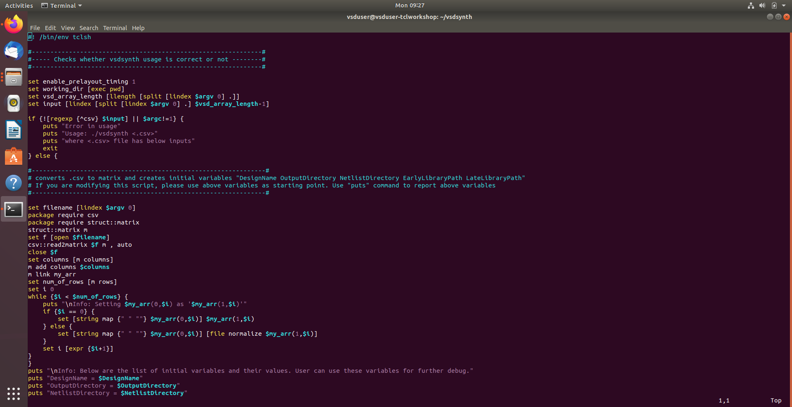
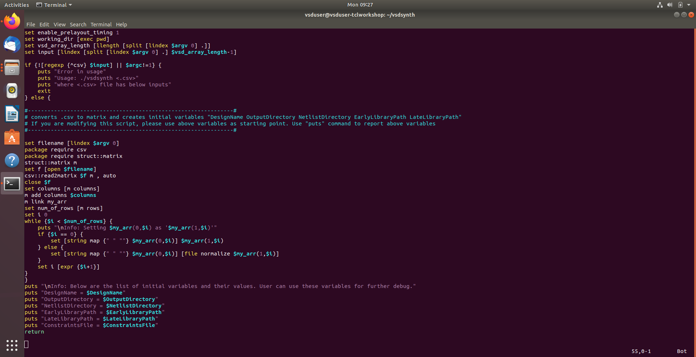
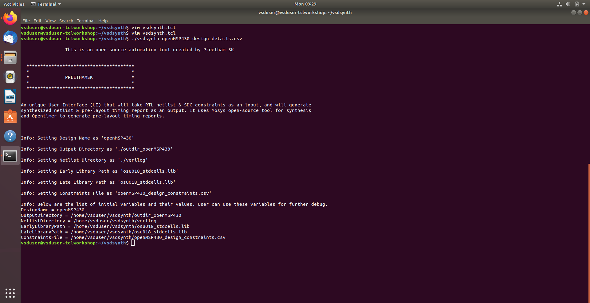
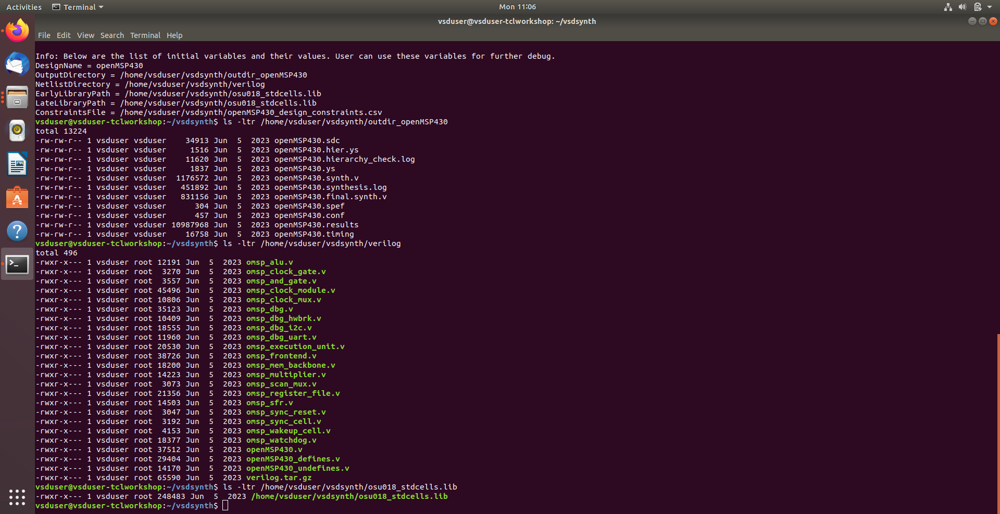
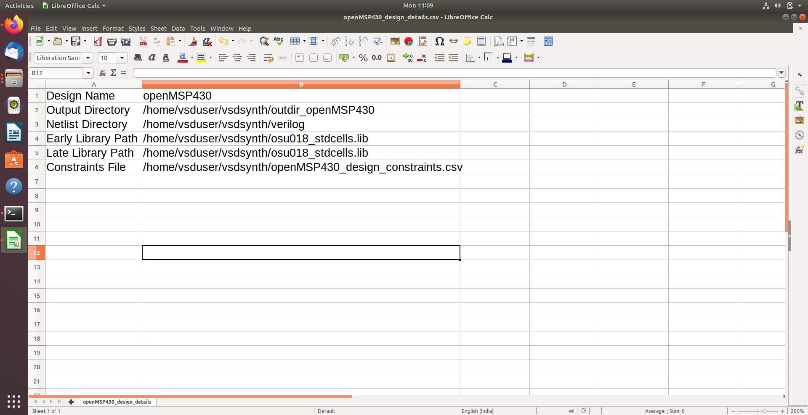

### Environment Validation & Constraint Matrix Conversion
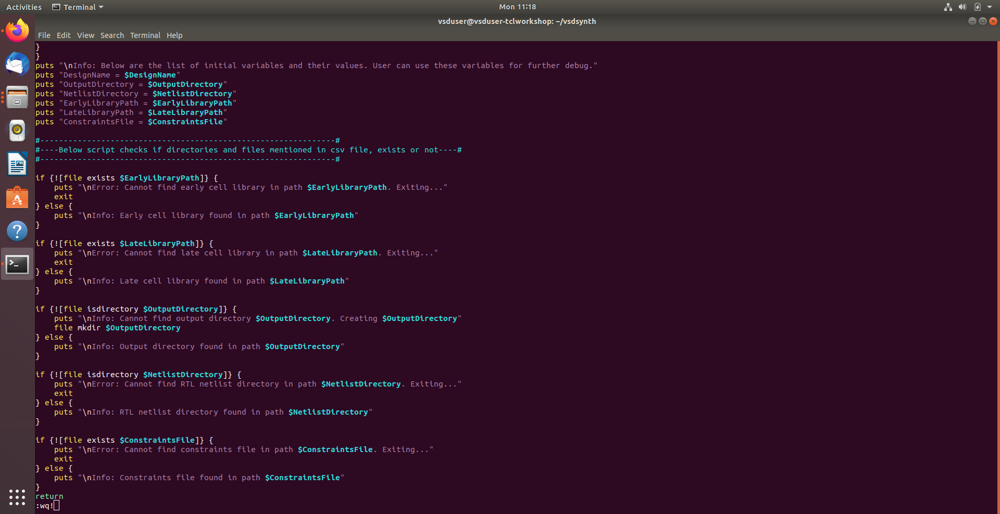
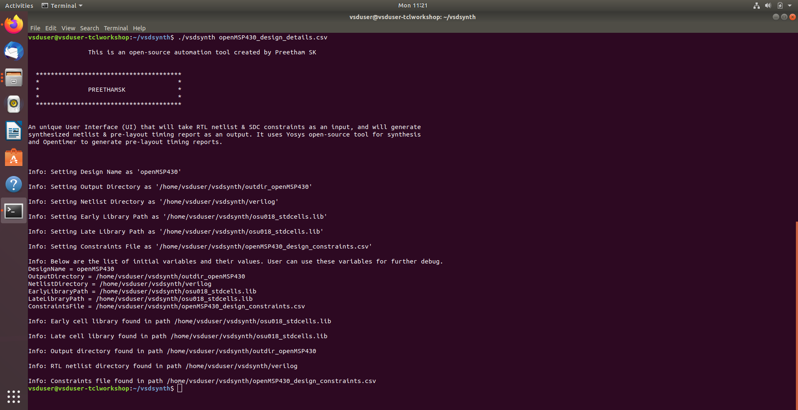
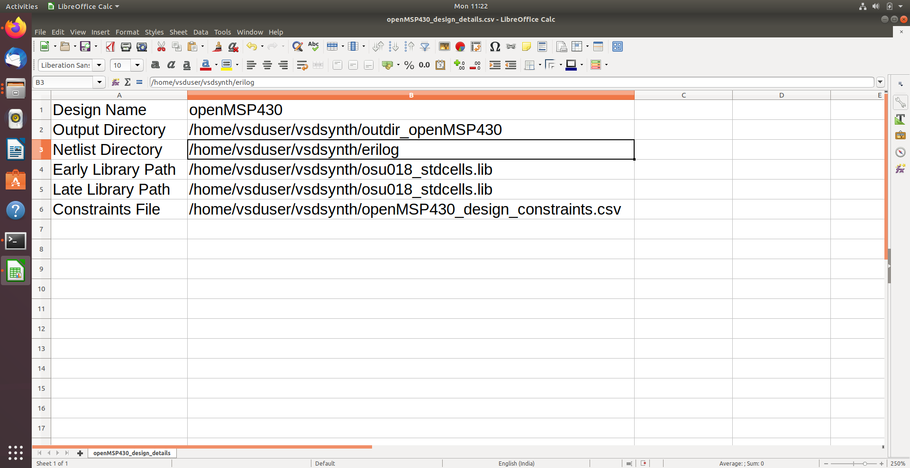
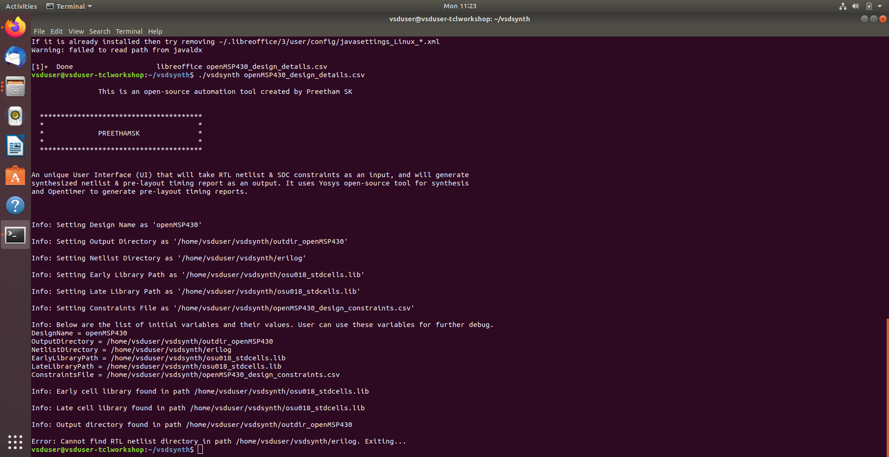
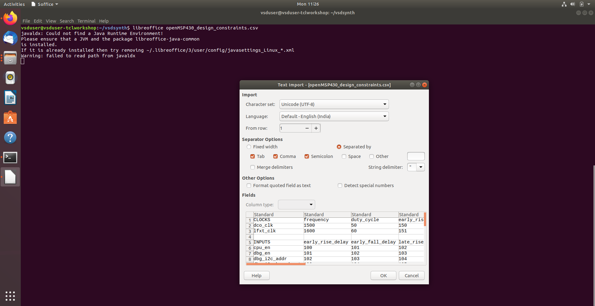
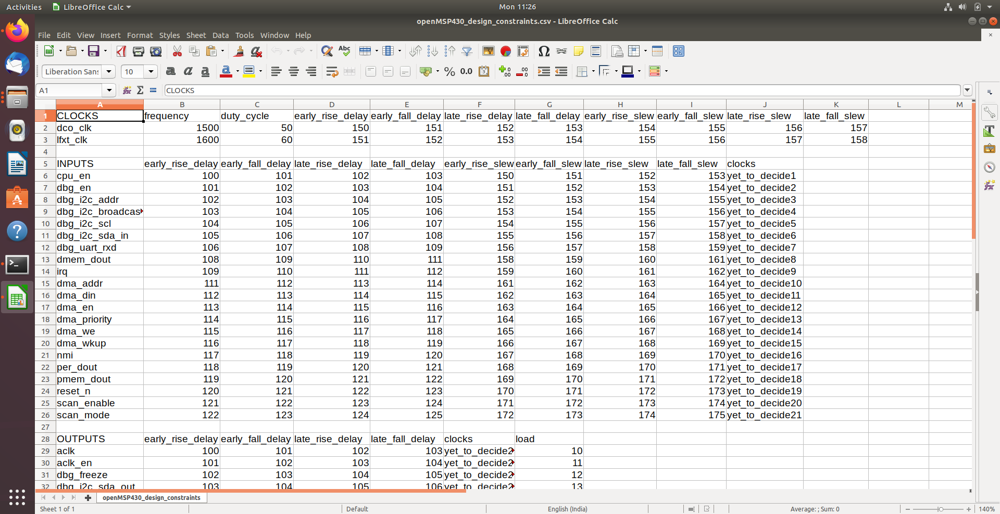
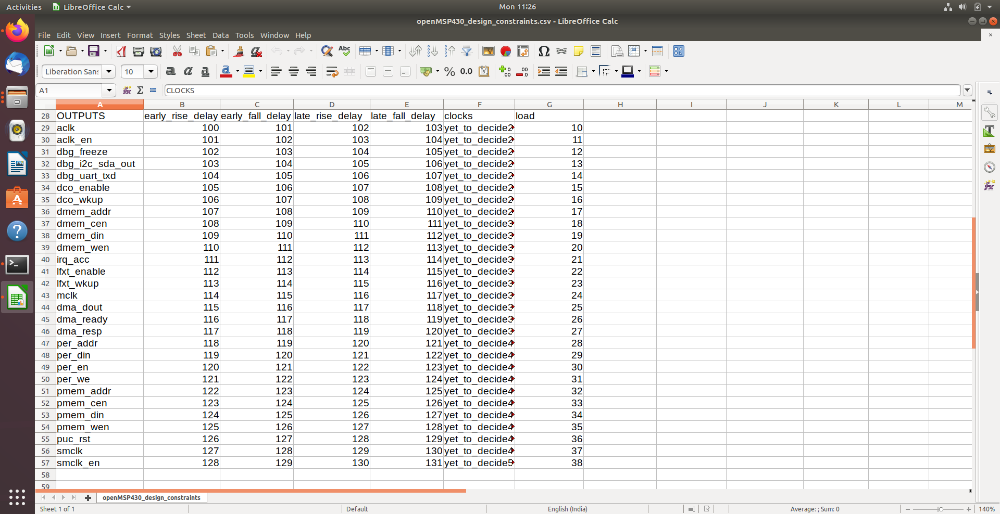

### Matrix Row Computation & Data Indexing
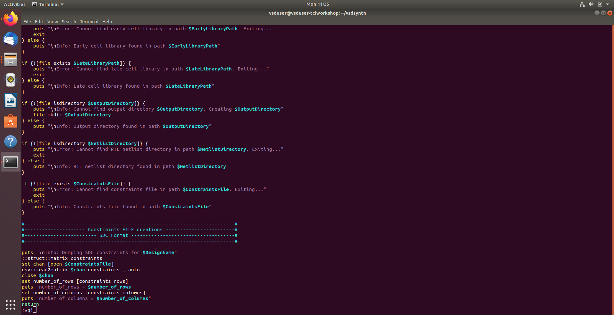
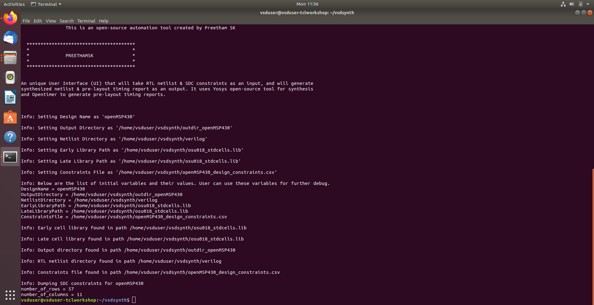
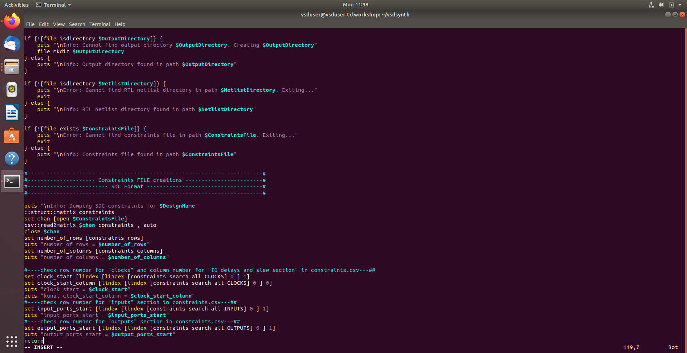
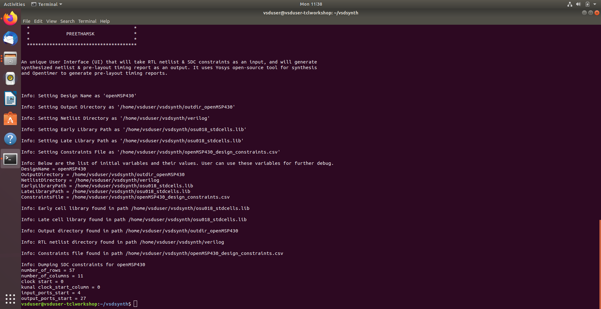

<h2>🔗 Navigation</h2>

[Back to Repository Overview](../README.md) &nbsp;|&nbsp; [Previous : 01 : TCL Toolbox Setup](../01%20:%20TCL%20Toolbox%20Setup) &nbsp;|&nbsp; [Next : 03 : Constraint Generation](../03%20:%20Constraint%20Generation)
